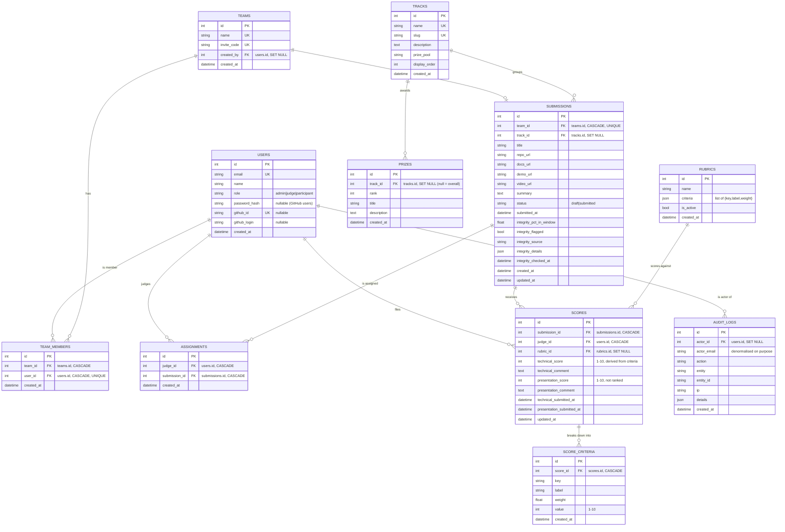

# Axion data model

Postgres 16 in production (SQLite in the test suite), one schema, eleven tables, one Alembic migration
chain. Everything the engine decides — who judged what, what they said, and what changed afterwards — is a
row somewhere in this document.

- Source of truth: `api/app/models.py` (SQLAlchemy 2 typed mappings)
- Migrations: `api/alembic/versions/0001_initial.py`, `api/alembic/versions/0002_event_and_rubrics.py`
- Connection: `api/app/db.py`

## Design rules

1. **No ORM relationships.** Every join is explicit. Lazy loading is the usual source of accidental
   N+1 queries in a read-mostly app, and the query layer here is small enough that being obvious is worth
   more than being terse.
2. **Uniqueness carries meaning.** The constraints are the enforcement of the domain rules (one team per
   person, one submission per team, one verdict per judge per project). They are not decoration.
3. **`ON DELETE` is chosen, not defaulted.** Deleting a user must never delete the audit trail; deleting a
   team may cascade to its members.
4. **Every derived number is stored.** `scores.technical_score` is stored even though it is derived from the
   criterion rows, because the ranking must not silently change if a rubric is later re-weighted.
5. **Timestamps are server-side.** `now()` defaults on insert, `onupdate=now()` where a row is mutable.
   Nothing about deadlines is trusted from a client.

## ERD



The same model as plain text, for anyone reading this without Mermaid:

```
users ─┬─< team_members >─┬─ teams ──1:1── submissions ──< assignments >── users (judge)
       │                  │                     │
       │                  └── created_by        ├── track_id ──> tracks ──< prizes
       │                                        └──< scores >── users (judge)
       │                                              │
       ├──< assignments (judge_id)                    ├── rubric_id ──> rubrics
       │                                              └──< score_criteria
       └──< audit_logs (actor_id)
```

## Tables

### `users`

One identity model for everyone, whatever the sign-in route. `password_hash` is nullable because a
participant who signs in with GitHub never gets a password; `github_id` is nullable for judges and admins
who never touch GitHub. Both are unique when present (`uq_users_email`, `uq_users_github_id`).

`role` is one of `admin`, `judge`, `participant` (`models.ROLES`) and is checked by the role guard in
`api/app/deps.py::require_role` on every protected route. Participants cannot reach a scoring endpoint at
all — the guard rejects before the handler runs.

Indexes: `ix_users_email`, `ix_users_role`.

### `teams` and `team_members`

A team owns exactly one submission (`uq_submissions_team`), and `team_members.user_id` is unique, so no
person can be on two teams. `invite_code` is 8 characters from an unambiguous alphabet, generated with
`secrets.choice` and re-rolled on collision.

`teams.created_by` is `SET NULL`, so a departing user does not take the team with them. `team_members` rows
cascade on either side.

### `tracks` and `prizes`

Organiser configuration, not code. A track is a competition category with a slug used by the public gallery
filter; prizes hang off a track or off nothing at all (`track_id IS NULL` means an overall prize).

Both `name` and `slug` are unique, so the public `/api/event` payload and the gallery filter can address a
track either way without collisions.

### `submissions`

One per team, and the only place where participant content lives. Two fields carry the event state machine:

- `status` — `draft` or `submitted`. A draft has no judge assignments, no Commit Integrity result, no
  gallery entry, and is excluded from the archive ranking. Assignment happens on the transition to
  `submitted` (`routers/submissions.py`).
- `submitted_at` — set once, on first submission, and never cleared. The 0002 migration backfills it from
  `created_at` for rows that predate drafts.

Commit Integrity is deliberately **not** part of the score: `integrity_pct_in_window`, `integrity_flagged`,
`integrity_source`, `integrity_details` (the raw GitHub/mock report) and `integrity_checked_at` exist so an
organiser can review a signal. `integrity_flagged` is indexed implicitly through `/api/admin/flagged`
queries and is surfaced on the console as a review queue, never as a disqualification.

Indexes: `ix_submissions_team_id`, `ix_submissions_track_id`, `ix_submissions_status`.

### `assignments`

The (judge, project) pair, uniquely constrained by `uq_assignment_pair`. This is the table that makes
Z-scores comparable: judges and projects are fully connected (see JUDGING.md §1). `ON DELETE CASCADE` on both
sides means removing a project cannot leave a dangling right-to-score.

### `rubrics` and `score_criteria`

`rubrics.criteria` is a JSON list of `{key, label, weight}`. Exactly one rubric is active
(`is_active = True`); re-weighting inserts a new row and deactivates the old one, so `scores.rubric_id`
always points at the weights that were in force.

`score_criteria` holds one row per (verdict, criterion) with a unique constraint on `uq_score_criterion_key`.
The judge's technical verdict is the weight-normalized mean of these values, clamped to 1–10
(`services.weighted_technical_score`). Storing the parts is what lets an organiser answer "how did this
project score on code quality specifically" without re-reading every comment.

### `scores`

The verdict table. `uq_score_pair` makes a judge's opinion on a project a single updatable row rather than a
log of competing values — the *history* lives in `audit_logs`, which is where history belongs.

Two independent tiers, each with its own timestamp: `technical_score`/`technical_submitted_at` and
`presentation_score`/`presentation_submitted_at`. The API refuses a presentation score while the technical
one is null (`403`), which is the data-level guarantee behind the blind-evaluation claim in JUDGING.md §2.
Only technical scores feed the ranking; presentation scores are retained for context and archival.

### `audit_logs`

Append-only, and enforced in the database rather than in the application:

```sql
CREATE OR REPLACE FUNCTION axion_audit_logs_immutable() RETURNS trigger AS $$
BEGIN
    RAISE EXCEPTION 'audit_logs is append-only (attempted %)', TG_OP;
END;
$$ LANGUAGE plpgsql;

CREATE TRIGGER axion_audit_logs_immutable
BEFORE UPDATE OR DELETE ON audit_logs
FOR EACH ROW EXECUTE FUNCTION axion_audit_logs_immutable();
```

Installed by `0001_initial` and dropped by its `downgrade()`. A compromised API key, a careless `psql`
session and a rogue migration all hit the same exception. `actor_email` is denormalised deliberately: the
trail must still name who did something after a user row is deleted, which is why `actor_id` is `SET NULL`
while the email string survives.

`details` is JSON and is where the substance lives — previous and new score values, criterion breakdowns,
export row counts, assignment counts, integrity percentages.

Representative actions: `auth.login`, `auth.login_failed`, `auth.dev_login`, `auth.logout`,
`auth.github_login`, `user.registered`, `team.created`, `team.joined`, `submission.draft_saved`,
`submission.created`, `submission.submitted`, `submission.updated`,
`submission.rejected_after_deadline`, `submission.integrity_rechecked`, `score.technical_submitted`,
`score.technical_modified`, `score.presentation_submitted`, `score.presentation_modified`, `judge.created`,
`assignments.backfilled`, `track.created`, `prize.created`, `rubric.updated`, `export.csv`,
`event.archived`, `event.archived_markdown`, `seed.run`.

Indexes: `ix_audit_logs_action`, `ix_audit_logs_created_at`.

## Constraints at a glance

| Table | Constraint | Enforces |
| ----- | ---------- | -------- |
| `users` | `uq_users_email` | one account per email |
| `users` | `uq_users_github_id` | one account per GitHub identity |
| `teams` | `uq_teams_name`, `uq_teams_invite_code` | unique team names and join codes |
| `team_members` | `uq_team_members_user` | one team per person |
| `tracks` | `uq_tracks_name`, `uq_tracks_slug` | addressable, unique tracks |
| `submissions` | `uq_submissions_team` | one submission per team |
| `assignments` | `uq_assignment_pair` | no double assignment |
| `scores` | `uq_score_pair` | one verdict per judge per project |
| `score_criteria` | `uq_score_criterion_key` | one value per criterion per verdict |

## Migration chain

| Revision | Adds |
| -------- | ---- |
| `0001_initial` | `users`, `teams`, `team_members`, `submissions`, `assignments`, `scores`, `audit_logs`, and the append-only trigger |
| `0002_event_and_rubrics` | `tracks`, `prizes`, `rubrics`, `score_criteria`; `submissions.{track_id,status,submitted_at}`, `scores.rubric_id`; backfills `submitted_at` |

`0002` is additive and nullable-or-defaulted throughout, so it applies to a database that is already running
an event: existing submissions become `submitted`, keep a null track, and are unaffected by the rubric.

The test suite builds the schema with `Base.metadata.create_all` for speed, and `0001`/`0002` are kept in
step with it by hand. When adding a column to a model, add it to a migration in the same commit — the two
paths must agree, and `docker compose up` runs `alembic upgrade head`.
