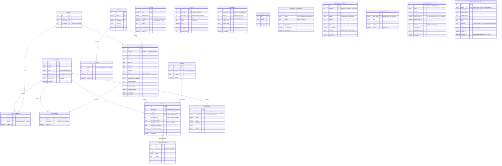

# Axion data model

Postgres 16 in production (SQLite in the test suite), one schema, twenty-two tables, one Alembic migration
chain. Everything the engine decides — who judged what, what they said, who voted, what the deployment
told a subscriber, when the event closes, and what changed afterwards — is a row somewhere in this
document.

- Source of truth: `api/app/models.py` (SQLAlchemy 2 typed mappings)
- Migrations: `api/alembic/versions/0001_initial.py` … `0010_event_settings.py`
- Connection: `api/app/db.py`

## Design rules

1. **No ORM relationships.** Every join is explicit. Lazy loading is the usual source of accidental
   N+1 queries in a read-mostly app, and the query layer here is small enough that being obvious is worth
   more than being terse.
2. **Uniqueness carries meaning.** The constraints are the enforcement of the domain rules (one team per
   person, one submission per team, one verdict per judge per project). They are not decoration.
3. **`ON DELETE` is chosen, not defaulted.** Deleting a user must never delete the audit trail; deleting a
   team may cascade to its members.
4. **Every derived number is stored.** `scores.technical_score` is stored even though it is derived from the
   criterion rows, because the ranking must not silently change if a rubric is later re-weighted.
5. **Timestamps are server-side.** `now()` defaults on insert, `onupdate=now()` where a row is mutable.
   Nothing about deadlines is trusted from a client.

## ERD


```mermaid
erDiagram
    USERS ||--o{ TEAM_MEMBERS : "is member"
    TEAMS ||--o{ TEAM_MEMBERS : "has"
    TEAMS ||--o| SUBMISSIONS : "owns one"
    TRACKS ||--o{ SUBMISSIONS : "groups"
    TRACKS ||--o{ PRIZES : "awards"
    USERS ||--o{ ASSIGNMENTS : "judges"
    SUBMISSIONS ||--o{ ASSIGNMENTS : "is assigned"
    USERS ||--o{ SCORES : "files"
    SUBMISSIONS ||--o{ SCORES : "receives"
    RUBRICS ||--o{ SCORES : "scores against"
    SCORES ||--o{ SCORE_CRITERIA : "breaks down into"
    USERS ||--o{ AUDIT_LOGS : "is actor of"

    USERS {
        int id PK
        string email UK
        string name
        string role "admin|judge|participant"
        string password_hash "nullable (GitHub users)"
        string github_id UK "nullable"
        string github_login "nullable"
        datetime created_at
    }
    TEAMS {
        int id PK
        string name UK
        string invite_code UK
        int created_by FK "users.id, SET NULL"
        datetime created_at
    }
    TEAM_MEMBERS {
        int id PK
        int team_id FK "teams.id, CASCADE"
        int user_id FK "users.id, CASCADE, UNIQUE"
        datetime created_at
    }
    TRACKS {
        int id PK
        string name UK
        string slug UK
        text description
        string prize_pool
        int display_order
        datetime created_at
    }
    PRIZES {
        int id PK
        int track_id FK "tracks.id, SET NULL (null = overall)"
        int rank
        string title
        text description
        datetime created_at
    }
    SUBMISSIONS {
        int id PK
        int team_id FK "teams.id, CASCADE, UNIQUE"
        int track_id FK "tracks.id, SET NULL"
        string title
        string repo_url
        string docs_url
        string demo_url
        string video_url
        text summary
        string status "draft|submitted"
        datetime submitted_at
        float integrity_pct_in_window
        bool integrity_flagged
        string integrity_source
        json integrity_details
        datetime integrity_checked_at
        datetime created_at
        datetime updated_at
    }
    ASSIGNMENTS {
        int id PK
        int judge_id FK "users.id, CASCADE"
        int submission_id FK "submissions.id, CASCADE"
        datetime created_at
    }
    RUBRICS {
        int id PK
        string name
        json criteria "list of {key,label,weight}"
        bool is_active
        datetime created_at
    }
    SCORES {
        int id PK
        int submission_id FK "submissions.id, CASCADE"
        int judge_id FK "users.id, CASCADE"
        int rubric_id FK "rubrics.id, SET NULL"
        int technical_score "1-10, derived from criteria"
        text technical_comment
        int presentation_score "1-10, not ranked"
        text presentation_comment
        datetime technical_submitted_at
        datetime presentation_submitted_at
        datetime updated_at
    }
    SCORE_CRITERIA {
        int id PK
        int score_id FK "scores.id, CASCADE"
        string key
        string label
        float weight
        int value "1-10"
        datetime created_at
    }
    AUDIT_LOGS {
        int id PK
        int actor_id "historical id; deliberately not a foreign key"
        string actor_email "denormalised on purpose"
        string action
        string entity
        string entity_id
        string ip
        json details
        datetime created_at
    }
    VOTERS {
        int id PK
        string email UK
        string display_name
        string token_hash UK "sha256 of the ballot token"
        datetime verified_at "set by following the link"
        bool blocked
        text blocked_reason
        datetime created_at
        datetime updated_at
    }
    VOTES {
        int id PK
        int voter_id FK "voters.id, CASCADE"
        int submission_id FK "submissions.id, CASCADE"
        int score "1-5"
        string status "cast|struck"
        datetime cast_at
        datetime struck_at
        string struck_by "denormalised, like the audit actor"
        text struck_reason
    }
    COMMENTS {
        int id PK
        int submission_id FK "submissions.id, CASCADE"
        int author_id FK "users.id, SET NULL"
        int voter_id FK "voters.id, SET NULL"
        string author_name
        string author_email
        text body
        string status "visible|hidden"
        datetime created_at
    }
    THROTTLE_EVENTS {
        int id PK
        string bucket
        string key
        int at_epoch
    }
    WEBHOOK_ENDPOINTS {
        int id PK
        string url
        string secret "signs every delivery to this endpoint"
        json events "empty = everything"
        bool active
        int failure_count
        datetime last_delivered_at
        datetime last_failed_at
    }
    WEBHOOK_DELIVERIES {
        int id PK
        int endpoint_id FK "webhook_endpoints.id, CASCADE"
        string event
        json payload "the envelope, stored as sent"
        string status "pending|delivered|failed|dead"
        int attempts
        int response_status
        text error
        datetime next_attempt_at
        string signature "sha256 over the stored bytes"
        datetime created_at
        datetime delivered_at
    }
    INVITE_TOKENS {
        int id PK
        string token_digest UK "sha256 of the raw link token"
        string email
        string invited_by "denormalised, like the audit actor"
        datetime expires_at
        datetime used_at "single use"
    }
    EVENT_SETTINGS {
        int id PK "always 1: CHECK (id = 1)"
        string name
        datetime starts_at
        datetime ends_at "the submission deadline"
        datetime voting_opens_at "the community window has its own clock"
        datetime voting_closes_at
        text note "why the clock moved"
        int revision "optimistic concurrency"
        int updated_by_id
        string updated_by_email
        datetime created_at
        datetime updated_at
    }
    PARTICIPATION_RECORDS {
        int id PK
        string code UK "public handle, inside the signed payload"
        string subject_kind "judge|participant|team"
        string subject_name
        string subject_email
        string event_name
        string role
        json payload "stored verbatim; the signature is over these bytes"
        string signature
        string algorithm "hmac-sha256"
        datetime issued_at
        datetime revoked_at "a fact beside the signature, not an edit"
        text revoked_reason
    }
```

The same model as plain text, for anyone reading this without Mermaid:

```
users ─┬─< team_members >─┬─ teams ──1:1── submissions ──< assignments >── users (judge)
       │                  │                     │
       │                  └── created_by        ├── track_id ──> tracks ──< prizes
       │                                        └──< scores >── users (judge)
       │                                              │
       ├──< assignments (judge_id)                    ├── rubric_id ──> rubrics
       │                                              └──< score_criteria
       └──< audit_logs (actor_id)

submissions ──< votes >── voters          (T3: one vote per address per project)
submissions ──< comments >──┬─ users      (T3: an author, or a voter, or neither)
                            └─ voters
webhook_endpoints ──< webhook_deliveries  (T4: an outbox row per event per endpoint)
participation_records                     (T4: signed, self-contained; no foreign keys at all)
throttle_events                           (T3: rate limiting that holds across workers)
invite_tokens                             (T2: single-use judge invite links, stored as digests)
event_settings                            (T3: zero rows = the configured window; one row = the organiser's)
```

`event_settings` is the one table here that describes the deployment rather than the event's contents, and
it references nothing on purpose. It holds **zero or one row**: zero means the event identity and window
come from configuration (`EVENT_*`, or the imported dataset under `EVENT_SOURCE=fixtures`), one means an
organiser has taken the clock over. That is why it is safe to add to a running deployment — a database that
has never seen this table behaves exactly as it did before the migration, which is also what keeps a fresh
`docker compose up` starting *closed* for the acceptance check. The `CHECK (id = 1)` is the singleton: two
rows would be two deadlines, and "which one is real" is not a question a portal should be able to ask.

The T4 record table deliberately references nothing. A record is a claim about a *moment* — `subject_ref` is
the identifier the subject had in the system it came from, not a live pointer — so a foreign key to `users`
or `teams` would make the claim falsifiable by deleting a row. That is the same reasoning the audit trail
uses for `actor_id`, applied to the artefact a participant actually walks away with.

## Tables

### `users`

One identity model for everyone, whatever the sign-in route. `password_hash` is nullable because a
participant who signs in with GitHub never gets a password; `github_id` is nullable for judges and admins
who never touch GitHub. Both are unique when present (`uq_users_email`, `uq_users_github_id`).

`role` is one of `admin`, `judge`, `participant` (`models.ROLES`) and is checked by the role guard in
`api/app/deps.py::require_role` on every protected route. Participants cannot reach a scoring endpoint at
all — the guard rejects before the handler runs.

Indexes: `ix_users_email`, `ix_users_role`.

### `teams` and `team_members`

A team owns exactly one **live** submission (`uq_submissions_team_canonical`), and `team_members.user_id` is
unique, so no person can be on two teams. `teams.source_ref` carries an imported dataset's own identifier,
and it is what uniqueness is keyed on: names repeat in real events (the organisers' fixture data has
"StillTrail" three times), so a name is never an identity. `invite_code` is 8 characters from an unambiguous alphabet, generated with
`secrets.choice` and re-rolled on collision.

`teams.created_by` is `SET NULL`, so a departing user does not take the team with them. `team_members` rows
cascade on either side.

### `tracks` and `prizes`

Organiser configuration, not code. A track is a competition category with a slug used by the public gallery
filter; prizes hang off a track or off nothing at all (`track_id IS NULL` means an overall prize).

Both `name` and `slug` are unique, so the public `/api/event` payload and the gallery filter can address a
track either way without collisions.

### `submissions` (see also `source_ref` below)

One per team, and the only place where participant content lives. Two fields carry the event state machine:

- `status` — `draft` or `submitted`. A draft has no judge assignments, no Commit Integrity result, no
  gallery entry, and is excluded from the archive ranking. Assignment happens on the transition to
  `submitted` (`routers/submissions.py`).
- `submitted_at` — set once, on first submission, and never cleared. The 0002 migration backfills it from
  `created_at` for rows that predate drafts.

Commit Integrity is deliberately **not** part of the score: `integrity_pct_in_window`, `integrity_flagged`,
`integrity_source`, `integrity_details` (the raw GitHub/mock report) and `integrity_checked_at` exist so an
organiser can review a signal. `integrity_flagged` is indexed implicitly through `/api/admin/flagged`
queries and is surfaced on the console as a review queue, never as a disqualification.

Indexes: `ix_submissions_team_id`, `ix_submissions_track_id`, `ix_submissions_status`.

### `assignments`

The (judge, project) pair, uniquely constrained by `uq_assignment_pair`. This is the table that makes
Z-scores comparable: judges and projects are fully connected (see JUDGING.md §1). `ON DELETE CASCADE` on both
sides means removing a project cannot leave a dangling right-to-score.

### `rubrics` and `score_criteria`

`rubrics.criteria` is a JSON list of `{key, label, weight}`. Exactly one rubric is active
(`is_active = True`); re-weighting inserts a new row and deactivates the old one, so `scores.rubric_id`
always points at the weights that were in force.

`score_criteria` holds one row per (verdict, criterion) with a unique constraint on `uq_score_criterion_key`.
The judge's technical verdict is the weight-normalized mean of these values, clamped to 1–10
(`services.weighted_technical_score`). Storing the parts is what lets an organiser answer "how did this
project score on code quality specifically" without re-reading every comment.

### `scores`

The verdict table. `uq_score_pair` makes a judge's opinion on a project a single updatable row rather than a
log of competing values — the *history* lives in `audit_logs`, which is where history belongs.

Two independent tiers, each with its own timestamp: `technical_score`/`technical_submitted_at` and
`presentation_score`/`presentation_submitted_at`. The API refuses a presentation score while the technical
one is null (`403`), which is the data-level guarantee behind the blind-evaluation claim in JUDGING.md §2.
Only technical scores feed the ranking; presentation scores are retained for context and archival.

### `audit_logs`

Append-only, and enforced in the database rather than in the application:

```sql
CREATE OR REPLACE FUNCTION axion_audit_logs_immutable() RETURNS trigger AS $$
BEGIN
    RAISE EXCEPTION 'audit_logs is append-only (attempted %)', TG_OP;
END;
$$ LANGUAGE plpgsql;

CREATE TRIGGER axion_audit_logs_immutable
BEFORE UPDATE OR DELETE ON audit_logs
FOR EACH ROW EXECUTE FUNCTION axion_audit_logs_immutable();
```

Installed by `0001_initial` and dropped by its `downgrade()`. A compromised API key, a careless `psql`
session and a rogue migration all hit the same exception. `actor_email` is denormalised deliberately: the
trail must still name who did something after a user row is deleted.

`actor_id` carried a foreign key with `ON DELETE SET NULL` until migration `0005_audit_actor_is_historical`.
PostgreSQL applies that action as an `UPDATE` of the audit row, which this trigger refuses — so a delete of a
user with history failed outright, and the trail could neither be anonymised nor left alone. The foreign key
is gone; `actor_id` is kept as the historical id it was at the time, verbatim, and the email string is what
names the actor. Found by the PostgreSQL integration suite (`api/tests/pg/`), the only place the pair could
be observed.

`details` is JSON and is where the substance lives — previous and new score values, criterion breakdowns,
export row counts, assignment counts, integrity percentages.

Representative actions: `auth.login`, `auth.login_failed`, `auth.dev_login`, `auth.logout`,
`auth.github_login`, `user.registered`, `team.created`, `team.joined`, `submission.draft_saved`,
`submission.created`, `submission.submitted`, `submission.updated`,
`submission.rejected_after_deadline`, `submission.integrity_rechecked`, `score.technical_submitted`,
`score.technical_modified`, `score.presentation_submitted`, `score.presentation_modified`, `judge.created`,
`assignments.backfilled`, `track.created`, `prize.created`, `rubric.updated`, `export.csv`,
`event.archived`, `event.archived_markdown`, `seed.run`.

Indexes: `ix_audit_logs_action`, `ix_audit_logs_created_at`.

### `import_batches`

One row per import attempt, dry run or applied. The diagnostics screen reads the **latest** row rather than
recomputing, so what an organiser reviews is exactly what was reported at import time.

| Column | Notes |
| ------ | ----- |
| `source` | The file or generator the rows came from (`fixtures.json`, `api/scripts/build_fixtures.py`) |
| `mode` | `dry_run` or `apply`. A dry run records the batch and writes nothing else |
| `fixture_version` | The dataset's own version number |
| `summary` | The whole diagnostics payload as JSON: counts, headline lines, invalid records, duplicates, coverage |
| `actor_id` / `actor_email` | Who asked for it; `SET NULL` on user delete so history survives |

### `duplicate_reviews`

An organiser's decision about a suspected duplicate. **Detection is not stored**: candidates are recomputed
deterministically on every request, so changing the detector cannot silently rewrite a past decision, and a
decision cannot be mistaken for a detection.

| Column | Notes |
| ------ | ----- |
| `submission_id` | The suspected duplicate |
| `duplicate_of_submission_id` | The canonical submission it resembles |
| `decision` | `duplicate` or `distinct` |
| `note` | Free text; why the decision was made |
| `actor_*` | Who decided, and when |

Unique on `(submission_id, duplicate_of_submission_id)`, so re-deciding updates rather than duplicates. A
confirmed duplicate is **flagged, never deleted**: removing a participant's work on the strength of a string
comparison is not a decision software should make.

### `voters`, `votes` and `comments` (T3)

**A voter is not a user.** The community surface is email-gated rather than account-based, so it has its own
subject table: an address, a display name, and a **SHA-256 digest** of the ballot token. The digest is what
is stored because the database must not be readable into a live ballot — the same reasoning that keeps
session cookies out of reach. `verified_at` is set by following the link, and `blocked`/`blocked_reason` are
an organiser's decision, which is why they are columns rather than deletions.

`votes` is deliberately narrow. `uq_vote_voter_submission` makes a second vote an *error*, so "changing your
mind" is not a way to vote twice; `status` is `cast` or `struck`, and striking keeps the row with `struck_at`,
`struck_by` and `struck_reason`. Nothing here can be updated into a different vote — the only permitted
change is an organiser removing one, and that leaves both the vote and the reason visible. `ip` and
`user_agent` are recorded for abuse review, not for identity.

`comments` has two possible authors and neither is required: `author_id` (a signed-in user) and `voter_id`
(a verified ballot) are both nullable and both `ON DELETE SET NULL`, so an account deletion does not destroy
a thread. `author_name` and `author_email` are denormalised for the same reason the audit trail denormalises
its actor: the comment must survive the account it came from. `status` is `visible`/`hidden` and nothing is
ever deleted by moderation.

### `event_settings` (the organiser's clock)

**Zero rows or one row, and the database says so.** `CHECK (id = 1)` is the singleton: two deadlines is the
one state this schema must make unrepresentable, because every reader — the write path that refuses a late
submission, the ballot, the certificate signer, the bundle export — resolves the window through a single
resolver (`api/app/eventconfig.py`), and a resolver with two answers is worse than no control at all.

A row is the organiser's **complete** statement of the window, with every timestamp `NOT NULL` and
materialised from whatever was effective when they first took the clock over. That is what makes a partial
edit partial: `PATCH {"ends_at": …}` moves the deadline and leaves the ballot window exactly where it was,
because the stored row already carries the ballot window rather than leaving it to be re-derived. Zero rows
is the normal state for a deployment that has never had its clock moved.

`revision` is optimistic concurrency — the console sends the revision it rendered, and a mismatch is a 409
rather than a silent overwrite of a colleague's edit. `note`, `updated_by_id` and `updated_by_email` are the
attribution: "the deadline moved" and "the deadline moved because the venue flooded" are different facts to
the participant reading the change afterwards, and the same change is written to `audit_logs` and announced
on the webhook catalogue.

The row **never overwrites the deployment's configuration**. `DELETE /api/admin/event` is the reset, and it
cannot fail to find the original because the original was never written over.

### `throttle_events` (T3)

One row per attempt: `bucket` (`vote.cast`, `comment.create`, …), `key` (a voter, an address, an IP) and
`at_epoch`. A rate limiter that lives in process memory silently stops applying the moment a deployment runs
more than one worker, which is exactly when it starts to matter, so the counter is a table. The
`(bucket, key, at_epoch)` index is what makes the window query cheap.

### `webhook_endpoints` and `webhook_deliveries` (T4)

An endpoint is a URL, a description, a **signing secret** and a subscription list (`events` empty means
everything). The secret is stored because delivery must be signed: a receiver has to be able to tell a call
from this deployment apart from anyone else who learned the URL. `failure_count` resets on a successful
delivery, so it means "currently failing" rather than "has ever failed".

A delivery is an **outbox row, not a log line**. `payload` holds the exact envelope as built at emit time and
`signature` the signature computed over it, so a retry is byte-identical to the first attempt — which is what
lets a receiver dedupe on the delivery id and verify the signature without re-deriving the body. `status`
walks `pending` → `delivered`, or `pending` → `dead` after the retry budget is spent; `dead` is a state, so
what was lost is visible and replayable rather than gone. `next_attempt_at` carries the backoff.

### `invite_tokens` (T2)

One-time judge onboarding. The organiser generates the token, the invitee follows the link and picks a name
and password, and only the **SHA-256 digest** of the raw token is stored — so a database snapshot cannot be
replayed into a judge account, exactly as with a password-reset link. `invited_by` is an email rather than a
foreign key, for the same reason the audit trail denormalises its actor: the invite must remain explainable
after the organiser account it came from is gone. `expires_at` plus `used_at` make it single-use and
short-lived, and both are checked on the way in rather than trusted from the link.

### `participation_records` (T4)

A self-contained, signed attestation about one person or team. The attested `summary`, the event name, the
signer, the algorithm and the key fingerprint all live **inside** the signed `payload`, which is stored
verbatim: verification is a comparison against those bytes, not a reconstruction from columns. That
distinction matters because rebuilding a payload would make the signature depend on how a backend
round-trips a timestamp, and the failure would only appear when somebody checked a certificate on a
different machine from the one that issued it.

`code` is a short public handle (`AXN-4F7Q-2M8Z`, drawn from an alphabet with no I/O/0/1 because it gets read
aloud), and it is *inside* the signed payload as well — a verifier told a code must be able to see that the
record they fetched is the record that code names. Nothing is ever edited: `revoked_at` and `revoked_reason`
are a dated fact beside the signature, because "issued then revoked" is a different claim from "never
issued".

### Source identifiers (`source_ref`)

`teams.source_ref`, `users.source_ref` and `submissions.source_ref` carry the identifier a row had in the
system it was imported
from (`proj_017`, `judge_03`). They are nullable, because a row created inside the app has no external
source, and they are what makes an import idempotent: importing the same file twice updates the same rows
instead of creating a second event.

## Constraints at a glance

| Table | Constraint | Enforces |
| ----- | ---------- | -------- |
| `users` | `uq_users_email` | one account per email |
| `users` | `uq_users_github_id` | one account per GitHub identity |
| `teams` | `uq_teams_name_app` (partial: `WHERE source_ref IS NULL`), `uq_teams_invite_code` | join codes are unique; team names are unique as created in this application, while an imported dataset is imported as published |
| `team_members` | `uq_team_members_user` | one team per person |
| `tracks` | `uq_tracks_name`, `uq_tracks_slug` | addressable, unique tracks |
| `submissions` | `uq_submissions_team_canonical` (partial: `WHERE duplicate_of_submission_id IS NULL`) | one live submission per team; a second row is storable only when marked as a duplicate of the first |
| `assignments` | `uq_assignment_pair` | no double assignment |
| `scores` | `uq_score_pair` | one verdict per judge per project |
| `score_criteria` | `uq_score_criterion_key` | one value per criterion per verdict |
| `voters` | `uq_voters_email`, unique `token_hash` | one ballot per address; a token cannot be read out of the database |
| `votes` | `uq_vote_voter_submission` | one vote per person per project — a second vote is an error, not an edit |
| `votes` | `ck_votes_score_range`, `ck_votes_status` | `score` ∈ 1–5 and `status` ∈ {cast, struck}, enforced in the database as well as the API |
| `comments` | `ck_comments_status` | `visible`/`hidden`: moderation hides, it never deletes |
| `webhook_deliveries` | `ck_webhook_deliveries_status` | `pending`/`delivered`/`failed`/`dead` — a dead delivery is a state, not a disappearance |
| `participation_records` | `uq_participation_records_code`, `ck_participation_records_kind` | one public code per record; `subject_kind` ∈ {judge, participant, team} |
| `event_settings` | `ck_event_settings_singleton` (`id = 1`) | one clock, enforced by the database rather than by the code that writes it |

## Migration chain

| Revision | Adds |
| -------- | ---- |
| `0010_event_settings` | `event_settings` — the organiser's clock, a singleton with a revision and an attributed note |
| `0009_judge_invites` | `invite_tokens` — one-time judge onboarding links, stored as digests |
| `0008_webhooks_and_records` | `webhook_endpoints`, `webhook_deliveries`, `participation_records` — the outbox, its receiver registry and the signed records |
| `0007_community_surface` | `voters`, `votes`, `comments`, `throttle_events` — the community surface and the rate limiter's storage |
| `0006_imported_reality_is_partial` | `teams.source_ref`, `submissions.duplicate_of_submission_id`; replaces `uq_teams_name` and `uq_submissions_team` with the partial indexes above |
| `0005_audit_actor_is_historical` | Fixes the append-only trigger against `ON DELETE SET NULL`: a user deleted after their action must not rewrite history |
| `0004_integrity_constraints` | Database-level domain checks for the values the API already validates (roles, statuses, score ranges) |
| `0003_import_and_coverage` | `import_batches`, `duplicate_reviews`, and the `source_ref` identifiers on `users`, `teams` and `submissions` |
| `0002_event_and_rubrics` | `tracks`, `prizes`, `rubrics`, `score_criteria`; `submissions.{track_id,status,submitted_at}`, `scores.rubric_id`; backfills `submitted_at` |
| `0001_initial` | `users`, `teams`, `team_members`, `submissions`, `assignments`, `scores`, `audit_logs`, and the append-only trigger |

`0002` onwards are additive and nullable-or-defaulted, so they apply to a database that is already running
an event: existing submissions become `submitted`, keep a null track, and are unaffected by the rubric.
`0007`, `0008`, `0009` and `0010` create new tables only, so an event that is mid-flight gains the community
surface, the outbox, judge invites and the organiser's clock without any existing row changing shape. `0010`
is the clearest case: a database that has never been given a row behaves exactly as it did before the
migration, because an empty `event_settings` means "the window is the configured one".

The test suite builds the schema with `Base.metadata.create_all` for speed, and the migrations are kept in
step with it — **by test, not by hand**: `api/tests/pg/test_migrations.py` migrates an empty PostgreSQL
database to head and then compares every reflected column, nullability and length against the models, and
`test_the_revision_chain_is_linear` pins the exact chain. That test is why `0007`/`0008` gained
`nullable=False` on their timestamp columns: the models said a delivery always has a creation time, the
migration left the column nullable, and the only reason that divergence did not reach a deployment is that
the comparison runs in CI. When adding a column to a model, add it to a migration in the same commit.
